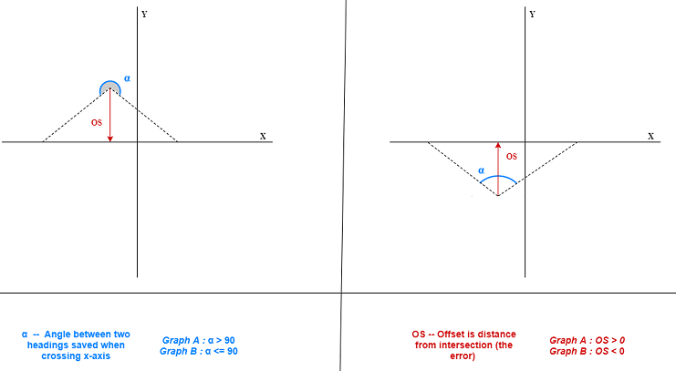
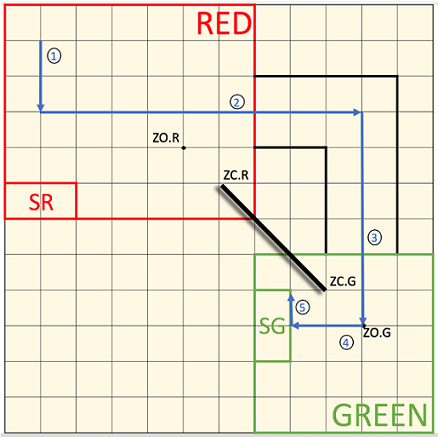

# Capture the flag LegoEv3

The system uses a combination of different sensors to play a game of Capture the Flag. The tasks the robot performs are as follows; localization (using both ultrasonic and light sensors), navigation, traverse a zipline/cross bridge, search and ‘capture’ a colored block, return to starting position. The ultrasonic localizations serves as an initial rough approximation to allow for a more accurate light localization. Light localization is performed regularly throughout navigation to ensure odometry accuracy.

    

## Technologies Used
* Lego Mindstorms Ev3
* LeJOS 0.9.1
* Eclipse neon.3

## Hardware

    

The Lego components are used to construct a robot with fairly capable functionality. A Lego Mindstorms Ev3 brick is used as the main computer to run the program. Two motors are used to drive the system. One is used to drive the zipline arm and the last one is positioned at the front of the robot to rotate the ultrasonic sensor used for avoiding obstacles. Extending arms each cary a light sensor capable of detecting colour. Both are at a precise height to allow the block to be captured to fit under the sensor. This ensures a constant distance between the sensor and the block to overcome the issue of the light sensor being highly dependent on the distance of the target. A large funnel is also implemented to allow a small margin of error while attempting to mount the zipline. The pulley therefore does not need to be perfectly aligned with the pole since the funnel will guide the pole to the pulley.

## Software

Being limited by the  300MHz ARM9 processor with only 64MB of RAM with a single core, the program is optimized to fit these constraints.

### Localisation

Localisation is a crucial component of the program for the robot to have an estimate of its current position on the game board. As the robot navigates, the position is tracked by an odometry system. The light localisation is the precise localisation which is repeated several time within a round as the position error is accumulated in the odometer. To perform this task, the robot first travels to an intersection of two grid lines. The physical position of the robot is very likely to be off by a certain offset in one of the four quadrants. The problem is to recover the information on which quadrant the robot lies in by processing the odometer headings saved at each line crossing. This problem can be split up into two sub problems, figuring out if the robot lies above or below the target X axis, then the same sub problem is applied to Y. The geometry can be seen in the figure below. The top angle between the two headings crossing the X axis labeled α provides some very useful information. If this angle is greater than 180°, it indicates that the robot lies above the axis. Conversely, if the angle is smaller than 180° the conclusion is that the robot is physically below the axis. The offset between the physical position and the axis can be calculated through trigonometry. The same logic can apply to the Y axis to perform correction on the x variable of the odometry. With the two independent sub problems, it is possible to figure out in which quadrant the robot lies and calculate its position accurately in a reliable and versatile way.

    

### Path Finding

The pathfinding algorithm is a very unique component of the system. It is based on a recursive backtracking algorithm and considers the position of the zipline to avoid collisions. To be able to navigate efficiently, the path is purely rectangular. The list passed in as an input is therefore modified by having node added in between all the initial node in the list such that each consecutive node has either the same variable x or the same variable y with the condition that no obstacles (zipline) are present in the straight line. The backtracking feature is used in cases where the path was modified up to a node where no further valid moves are possible. In this situation, it can undo prior modifications made to the path up to some point where new directions can be taken to try a different solution.

    

